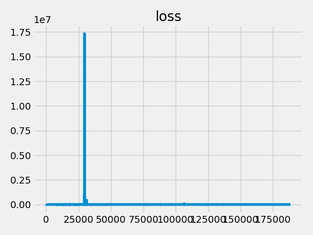
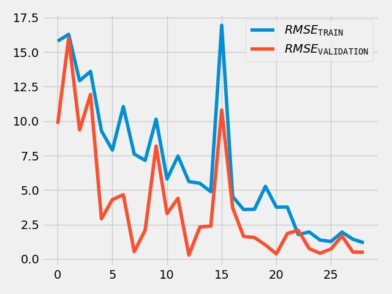
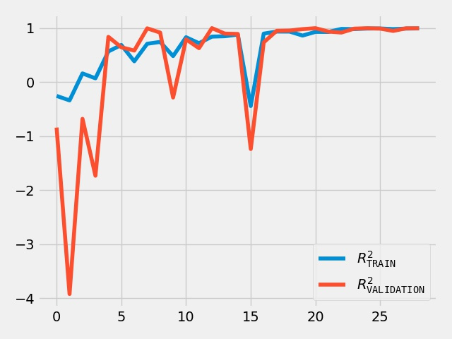

2020-03-12-114138592171
===========================
# Model Summary
model=gcn_with_combine_readout
config=['128', 'relu', '128', 'relu', '128', 'relu', '128', 'relu', '128', 'relu', '128', 'relu', '1']
hetero=True
data=ani
batch_size=16
n_epochs=30
size=100000
optimizer=Adam
learning_rate=1e-05
loss_fn=mse_loss
n_batches_in_buffer=12
cache=True
n_batches_te=100
n_batches_vl=100
report=True

Net(
  (f_in): Sequential(
    (0): Linear(in_features=117, out_features=128, bias=True)
    (1): Tanh()
  )
  (d0): GN(
    (gn): SAGEConv(
      (feat_drop): Dropout(p=0.0, inplace=False)
      (fc_self): Linear(in_features=128, out_features=128, bias=True)
      (fc_neigh): Linear(in_features=128, out_features=128, bias=True)
    )
  )
  (readout): ParamReadout(
    (fr_atom): Sequential(
      (0): Linear(in_features=1, out_features=128, bias=True)
      (1): Linear(in_features=128, out_features=2, bias=True)
    )
    (fr_bond): Sequential(
      (0): Linear(in_features=1, out_features=128, bias=True)
      (1): Linear(in_features=128, out_features=2, bias=True)
    )
    (fr_angle): Sequential(
      (0): Linear(in_features=1, out_features=128, bias=True)
      (1): Linear(in_features=128, out_features=2, bias=True)
    )
    (fr_torsion): Sequential(
      (0): Linear(in_features=1, out_features=128, bias=True)
      (1): Linear(in_features=128, out_features=2, bias=True)
    )
    (fr_angle_0): Linear(in_features=3, out_features=1, bias=True)
    (fr_torsion_0): Linear(in_features=4, out_features=1, bias=True)
    (fr_bond_0): Linear(in_features=2, out_features=1, bias=True)
    (fr_mol): Sequential(
      (0): Linear(in_features=1, out_features=128, bias=True)
      (1): Tanh()
      (2): Linear(in_features=128, out_features=1, bias=True)
    )
  )
  (d2): GN(
    (gn): SAGEConv(
      (feat_drop): Dropout(p=0.0, inplace=False)
      (fc_self): Linear(in_features=128, out_features=128, bias=True)
      (fc_neigh): Linear(in_features=128, out_features=128, bias=True)
    )
  )
  (d4): GN(
    (gn): SAGEConv(
      (feat_drop): Dropout(p=0.0, inplace=False)
      (fc_self): Linear(in_features=128, out_features=128, bias=True)
      (fc_neigh): Linear(in_features=128, out_features=128, bias=True)
    )
  )
  (d6): GN(
    (gn): SAGEConv(
      (feat_drop): Dropout(p=0.0, inplace=False)
      (fc_self): Linear(in_features=128, out_features=128, bias=True)
      (fc_neigh): Linear(in_features=128, out_features=128, bias=True)
    )
  )
  (d8): GN(
    (gn): SAGEConv(
      (feat_drop): Dropout(p=0.0, inplace=False)
      (fc_self): Linear(in_features=128, out_features=128, bias=True)
      (fc_neigh): Linear(in_features=128, out_features=128, bias=True)
    )
  )
  (d10): GN(
    (gn): SAGEConv(
      (feat_drop): Dropout(p=0.0, inplace=False)
      (fc_self): Linear(in_features=128, out_features=128, bias=True)
      (fc_neigh): Linear(in_features=128, out_features=128, bias=True)
    )
  )
  (d12): GN(
    (gn): SAGEConv(
      (feat_drop): Dropout(p=0.0, inplace=False)
      (fc_self): Linear(in_features=128, out_features=1, bias=True)
      (fc_neigh): Linear(in_features=128, out_features=1, bias=True)
    )
  )
)
# Time Used 
28205.01

# Dataset Size
Training samples: 
Training: 100609, Validation: 1601, Test: 1601
# Performance
|              |R2            |RMSE          |
|------------- |------------- |------------- |
|TRAIN         |0.99          |1.18          |
|VALIDATION    |1.00          |0.49          |
|TEST          |-150.27       |0.93          |

