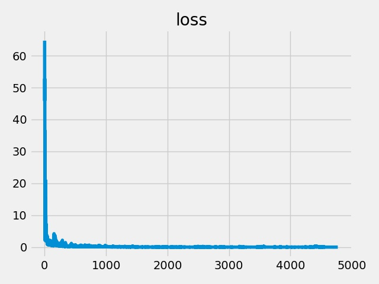
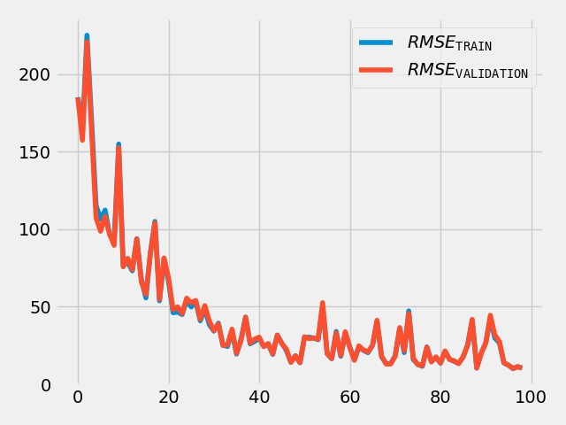
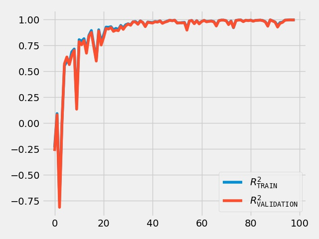

2020-02-17-170536920412
===========================
# Model Summary
model=gcn_with_combine_readout
config=['256', 'relu', '256', 'relu', '256', 'relu', '256', 'relu', '256', 'relu', '256', 'relu']
hetero=True
data=qc_archive
batch_size=32
n_epochs=100
size=100
optimizer=Adam
learning_rate=0.001
loss_fn=mse_loss
n_batches_in_buffer=12
cache=True
n_batches_te=10
n_batches_vl=10
report=True

Net(
  (d0): GCN(
    (apply_mod): NodeFullyConnect(
      (linear): Linear(in_features=10, out_features=256, bias=True)
    )
  )
  (readout): ParamReadout(
    (fr_atom): Sequential(
      (0): Linear(in_features=256, out_features=32, bias=True)
      (1): Tanh()
      (2): Linear(in_features=32, out_features=2, bias=True)
    )
    (fr_bond): Sequential(
      (0): Linear(in_features=256, out_features=32, bias=True)
      (1): Tanh()
      (2): Linear(in_features=32, out_features=2, bias=True)
    )
    (fr_angle): Sequential(
      (0): Linear(in_features=256, out_features=32, bias=True)
      (1): Tanh()
      (2): Linear(in_features=32, out_features=2, bias=True)
    )
    (fr_torsion): Sequential(
      (0): Linear(in_features=256, out_features=32, bias=True)
      (1): Tanh()
      (2): Linear(in_features=32, out_features=2, bias=True)
    )
    (fr_mol): Sequential(
      (0): Linear(in_features=256, out_features=32, bias=True)
      (1): Tanh()
      (2): Linear(in_features=32, out_features=1, bias=True)
    )
  )
  (d2): GCN(
    (apply_mod): NodeFullyConnect(
      (linear): Linear(in_features=256, out_features=256, bias=True)
    )
  )
  (d4): GCN(
    (apply_mod): NodeFullyConnect(
      (linear): Linear(in_features=256, out_features=256, bias=True)
    )
  )
  (d6): GCN(
    (apply_mod): NodeFullyConnect(
      (linear): Linear(in_features=256, out_features=256, bias=True)
    )
  )
  (d8): GCN(
    (apply_mod): NodeFullyConnect(
      (linear): Linear(in_features=256, out_features=256, bias=True)
    )
  )
  (d10): GCN(
    (apply_mod): NodeFullyConnect(
      (linear): Linear(in_features=256, out_features=256, bias=True)
    )
  )
)
# Time Used 
2699.19

# Dataset Size
Training samples: 
Training: 1537, Validation: 321, Test: 321
# Performance
|              |R2            |RMSE          |
|------------- |------------- |------------- |
|TRAIN         |1.00          |10.55         |
|VALIDATION    |1.00          |10.29         |
|TEST          |1.00          |10.17         |

