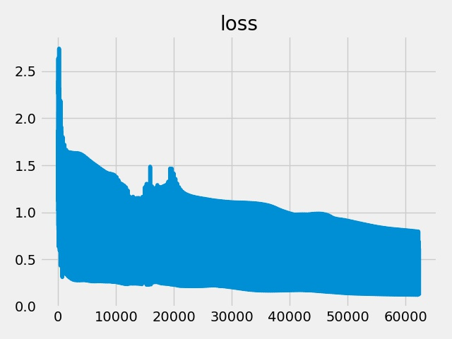
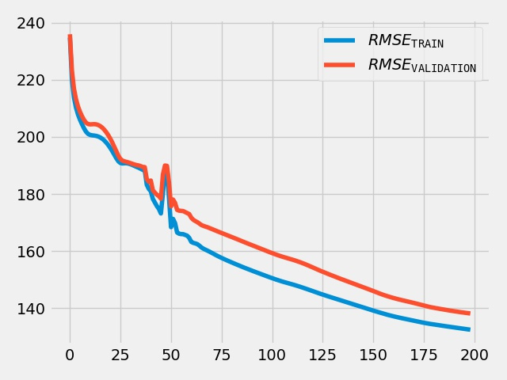
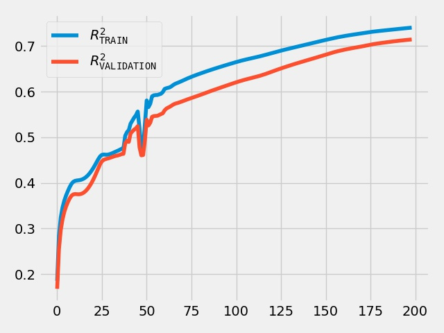

2020-02-16-164431636806
===========================
# Model Summary
model=gcn
config=['64', 'sigmoid', '64', 'sigmoid', '64', 'sigmoid', '64', 'sigmoid', '64', 'sigmoid', '64', 'sigmoid', '1']
hetero=False
data=QM9
batch_size=32
n_epochs=200
size=10000
optimizer=Adam
learning_rate=0.001
loss_fn=mse_loss
n_batches_in_buffer=12
cache=True
n_batches_te=30
n_batches_vl=30
report=True

Net(
  (d0): GCN(
    (apply_mod): NodeFullyConnect(
      (linear): Linear(in_features=10, out_features=64, bias=True)
    )
  )
  (d2): GCN(
    (apply_mod): NodeFullyConnect(
      (linear): Linear(in_features=64, out_features=64, bias=True)
    )
  )
  (d4): GCN(
    (apply_mod): NodeFullyConnect(
      (linear): Linear(in_features=64, out_features=64, bias=True)
    )
  )
  (d6): GCN(
    (apply_mod): NodeFullyConnect(
      (linear): Linear(in_features=64, out_features=64, bias=True)
    )
  )
  (d8): GCN(
    (apply_mod): NodeFullyConnect(
      (linear): Linear(in_features=64, out_features=64, bias=True)
    )
  )
  (d10): GCN(
    (apply_mod): NodeFullyConnect(
      (linear): Linear(in_features=64, out_features=64, bias=True)
    )
  )
  (d12): GCN(
    (apply_mod): NodeFullyConnect(
      (linear): Linear(in_features=64, out_features=1, bias=True)
    )
  )
)
# Time Used 
1105.77

# Dataset Size
Training samples: 
Training: 9985, Validation: 961, Test: 961
# Performance
|              |R2            |RMSE          |
|------------- |------------- |------------- |
|TRAIN         |0.74          |132.49        |
|VALIDATION    |0.72          |138.11        |
|TEST          |0.78          |124.77        |

